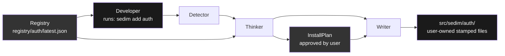

# Sedim 


[](https://discord.com/invite/H7yutstM)
[](https://github.com/Sedimie/Sedim)
[](https://www.npmjs.com/package/@sedim/)
[](./LICENSE)

**Install complete features. Own every line.**

Sedim is an open-source codegen CLI that stamps full-stack modules into your project, with out of the box working defaults. No runtime dependencies, no black boxes - every stamped file is readable, editable, and owned by you. Skip the 80% work done repetetively for just the 20% customizations on top.

```bash
npm install -g @sedim/cli

sedim init         # detects your stack
sedim add auth     # stamps auth into your project
```

The first POC for the stamping model is the Auth Module. Currently supports NextJS ( full stack ) ,Hono and Express (with react and vue frontends).

---
 
## See It In Action
 
<!-- Replace with your actual YouTube embed or linked thumbnail -->
[](https://www.youtube.com/watch?v=YOUR_VIDEO_ID)
 
> 10-minute walkthrough - init, auth install, OAuth, TOTP, UI themes, and customization.
 
---
 
## Quick Start
 
**Requirements:** Node ≥ 18, an existing project with a supported framework and ORM.
 
### 1. Install the CLI
 
```bash
npm install -g @sedim/cli
```
 
### 2. Initialise your project
 
```bash
cd my-project
sedim init
```
 
Sedim detects your framework, ORM, and language and writes a `sedim.config.ts`. If anything is detected incorrectly, edit the config file directly.
 
### 3. Add auth
 
```bash
sedim add auth
```
 `Before writing the module directly, you can either run plan, diff or dry-run commands for the module as well!` 

The CLI walks you through:
 
- **Environment detection** : confirms your framework, ORM, and language
- **Feature selection** : email/password, OAuth providers, TOTP, magic links, JWT, RBAC/ABAC
- **Frontend style** : headless, Tailwind styled, or themed with CSS tokens
- **Confirm the plan** : review exactly what files will be stamped before anything is written
- **Stamp** : files land in `src/sedim/auth/`
- **Environment variables** : add them on the spot or copy the printed list to your `.env`
### 4. Migrate and run
 
```bash
# Drizzle
npx drizzle-kit push
 
# or Prisma
npx prisma migrate dev --name add_auth
 
npm run dev
```
 
---
 
## What Gets Stamped

Running `sedim add auth` generates this structure in your project. You own every file.

The exact files that get stamped depend on the features you select during `sedim add auth` - OAuth providers, TOTP, magic links, JWT, and UI tier all gate which files are written. The structure below shows the full set of possible files; your install will include only the ones your selections require.

```
src/sedim/auth/
├── core/
│   ├── hash-password.ts     — Argon2id password hashing
│   ├── generate-token.ts    — session tokens, OTP codes, backup codes, PKCE verifiers
│   ├── session.ts           — session building and sliding-window validation
│   ├── pkce.ts              — RFC 7636 PKCE (S256 only)
│   ├── totp.ts              — RFC 6238 TOTP (Google Authenticator compatible)
│   ├── totp-crypto.ts       — AES-256-GCM encryption for TOTP secrets
│   ├── rate-limit.ts         — sliding-window rate limiter
│   ├── rbac.ts               — role-based access control
│   ├── abac.ts               — attribute-based access control
│   ├── jwt.ts                — hybrid JWT (short-lived signed + DB-backed refresh)
│   ├── oidc.ts               — OIDC discovery and id_token validation
│   └── email-transport.ts    — multi-transport email (nodemailer/resend/postmark/ses)
├── adapters/
│   ├── framework/
│   │   ├── nextjs.ts         — Next.js App Router handler factory
│   │   ├── express.ts        — Express router
│   │   ├── hono.ts           — Hono route registration
│   │   ├── operations.ts     — all auth operations (login, signup, OAuth, TOTP, etc.)
│   │   └── framework-config.ts — OAuth provider configuration
│   ├── drizzle.ts            — Drizzle ORM adapter
│   ├── prisma.ts             — Prisma ORM adapter
│   └── types.ts              — DatabaseAdapter interface and types
├── ui/
│   ├── auth-client.ts         — client-side auth fetch utilities
│   ├── use-auth.ts            — React hook for auth state
│   ├── headless/             — unstyled, logic-only components
│   │   ├── LoginForm.tsx
│   │   ├── SignupForm.tsx
│   │   ├── ForgotPasswordForm.tsx
│   │   ├── ResetPasswordForm.tsx
│   │   ├── MagicLinkForm.tsx
│   │   ├── OAuthButton.tsx
│   │   └── TotpVerifyForm.tsx
│   ├── tailwind/              — Tailwind-styled components
│   └── themed/                — pre-built themes with CSS tokens
│       ├── modern-tokens.css  — glassmorphism theme
│       ├── minimal-tokens.css — neumorphism theme
│       └── colorful-tokens.css — neubrutalism theme
├── emails/
│   └── email-verification.ts  — email template for verification
├── schema.ts                  — Drizzle schema (users, sessions, oauth_accounts, etc.)
└── index.ts                   — module barrel export
```

The stamped auth route handler lands at `src/app/api/auth/[...all]/route.ts` (Next.js) or equivalent for other frameworks.
 
---
 
## Auth Module
 
Auth is the first Sedim module. It ships with everything, none of it is a black box.

[Screencast from 2026-05-24 17-31-01.webm](https://github.com/user-attachments/assets/7f444748-d0bf-4329-a4cc-60507ae8b4df)

 
### Features
 
| Feature | Detail |
|---|---|
| **Password auth** | Argon2id (OWASP params), account lockout after 10 failed attempts |
| **Session management** | SHA-256 hashed tokens, httpOnly cookies, full revocation |
| **OAuth** | Google, GitHub, Discord :  PKCE (RFC 7636) on all flows |
| **TOTP** | RFC 6238, AES-256-GCM encrypted secrets at rest, backup codes |
| **Magic links** | No email enumeration, supports SMTP / Resend / Postmark / SES |
| **JWT** | Hybrid: short-lived signed JWTs + DB-backed refresh tokens |
| **RBAC / ABAC** | Role and attribute-based access control middleware |
| **Rate limiting** | Sliding window, in-memory or Redis store |
 
### Stack Support
 
| Framework | Drizzle | Prisma |
|-----------|:-------:|:------:|
| Next.js (App Router) | ✓ | ✓ |
| Express | ✓ | ✓ |
| Hono | ✓ | ✓ |
 
| Email provider | Supported |
|---|:---:|
| Nodemailer (SMTP) | ✓ |
| Resend | ✓ |
| Postmark | ✓ |
| AWS SES | ✓ |
 
### UI Tiers
 
Three levels so you use your own design system or ship immediately.

[Screencast from 2026-05-24 17-36-47.webm](https://github.com/user-attachments/assets/2c910cd5-8de8-4468-a2fd-db5011edd8d2)

 
**Headless** - zero CSS, pure logic and markup. Bring your own styles.
 
**Tailwind** - fully styled with Tailwind classes, works with your existing Tailwind config.
 
**Themed** - pre-built themes with CSS tokens. Currently ships `minimal` and `glass`.
 
### Environment Variables
 
```bash
# Required
AUTH_SECRET=                    # min 32 chars, used for session signing
DATABASE_URL=                   # your database connection string
 
# OAuth - add only the providers you selected
GOOGLE_CLIENT_ID=
GOOGLE_CLIENT_SECRET=
GITHUB_CLIENT_ID=
GITHUB_CLIENT_SECRET=
DISCORD_CLIENT_ID=
DISCORD_CLIENT_SECRET=
 
# Email - add only the provider you selected
SMTP_HOST=
SMTP_PORT=
SMTP_USER=
SMTP_PASS=
RESEND_API_KEY=
POSTMARK_API_KEY=
AWS_ACCESS_KEY_ID=
AWS_SECRET_ACCESS_KEY=
AWS_SES_REGION=
 
# Optional
REDIS_URL=                      # if using Redis for rate limiting or sessions
TOTP_ENCRYPTION_KEY=            # required if TOTP is enabled, 32-byte hex
```
 
---
 
## Architecture

Sedim uses a **stamp model**, not a runtime SDK:

```
sedim add auth  →  generates files into src/sedim/auth/
                   (standalone forever, no sedim dependency at runtime)
```

The CLI has four components:

| Component | What it does |
|---|---|
| **Detector** | Reads your project, framework, ORM, language, existing config |
| **Planner (Thinker)** | Combines the module manifest with your feature selections into a stamp plan |
| **Writer** | Executes the plan, generates files, migrations, env var list |
| **Showbaby** | Shows you exactly what was stamped and what to do next |

Every module is described by a **manifest** (`registry/<module>/latest.json`) - a declarative spec of every file the module can stamp, what features gate each file, and what environment variables are required. The CLI reads the manifest, applies your choices, and stamps only what you need.



The module source lives in `packages/<module>/src/` - this is where auth logic, UI components, adapters, and templates live. The CLI reads from here when stamping. `packages/core/` holds shared TypeScript types used by both the CLI and all modules.
 
---
 
## Registry
 
Module manifests live in the [`registry/`](https://github.com/Sedimie/Sedim/tree/main/registry) directory. The CLI uses the local registry during development and falls back to the GitHub raw URL for published releases.
 
**Available modules:**

| Module | Status |
|---|---|
| `auth` | Available |
| `notifications` | On the roadmap |
| `chat` | On the roadmap |
| `WebRTC` | On the roadmap |
| `WalletAdapters` | On the roadmap |
| `ai-rag` | On the roadmap |
| `payments` | On the roadmap |
 
---
## Philosophy
 
Most tools give you an API to call. Customization is what's keeping modularizing full stack features at bay, but with codegen model, you own the code, and hence customize it however much you want. This is not just a library to cut your grunt work, you can learn the overall implementations it uses to be able to basically use the full stack features as boilerplate code.
 
When you run `sedim add auth`, you get the auth system, not a dependency on one. The files live in your repo, show up in your git history, and bend to whatever you need them to do. Sedim writes the first version. Everything after that is yours.
 
*The best code is code you own.*


AI Agentic coding is another thing that this might clash with, but an AI tool might hallucinate and give 90% accuracy, leave out security considerations and make it tough to customize while also using up 3 hours and a considerable amount of tokens. This allows you to skip directly to the customizations part, with 100% hit-rate since it's static codegen, and 0 cost for the grunt work with upto date security standards being followed. Use AI tools on top of this to speed you up and make your workflow unbelievably fast.

---

### Check out the docs
Full documentation - customization guides, adapter references, module authoring, and escape hatches - is at [sedim.dev/docs](https://sedim.dev/docs).

### Contributions
To add a framework adapter, ORM adapter, or new module, see [CONTRIBUTING.md](./CONTRIBUTING.md).
 
The module spec and adapter interface are documented there - adding a new adapter for a supported module takes a few hours once you understand the pattern.
